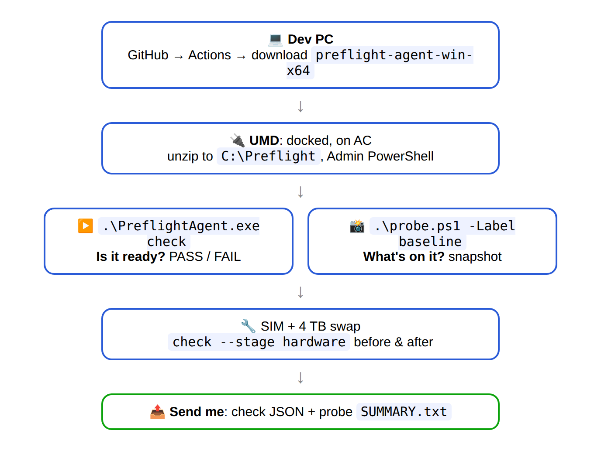

# Tomorrow on the UMD

| Tool | Tells you |
|---|---|
| `PreflightAgent.exe check` | **Is the laptop ready?** (PASS / FAIL) |
| `probe.ps1` | **What's on the laptop?** (raw values for me) |

- Both only read. Nothing changes on the laptop.
- No exe (build red)? Just run `probe.ps1` from `scripts\probe\`.
- Script blocked? Open it in **PowerShell ISE (Admin)** → F5.

**After: send me**
1. `C:\ProgramData\Preflight\results\check-<time>.json`
2. `C:\PreflightProbe\baseline-<time>\SUMMARY.txt` (the full `.probe.zip` next to it if you can)

No passwords inside, but they do have serials and hostnames. Don't commit them to git.
