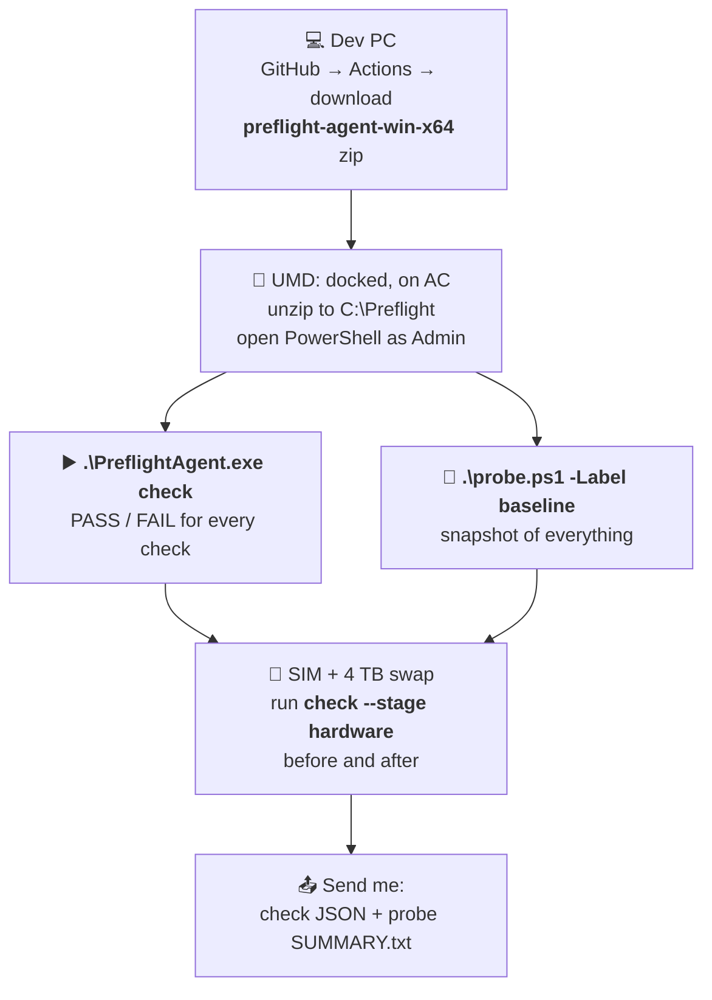

# Tomorrow on the UMD

| Tool | Tells you |
|---|---|
| `PreflightAgent.exe check` | **Is the laptop ready?** (PASS / FAIL) |
| `probe.ps1` | **What's on the laptop?** (raw values for me) |

- Both only read. Nothing changes on the laptop.
- No exe (build red)? Just run `probe.ps1` from `scripts\probe\`.
- Script blocked? Open it in **PowerShell ISE (Admin)** → F5.
