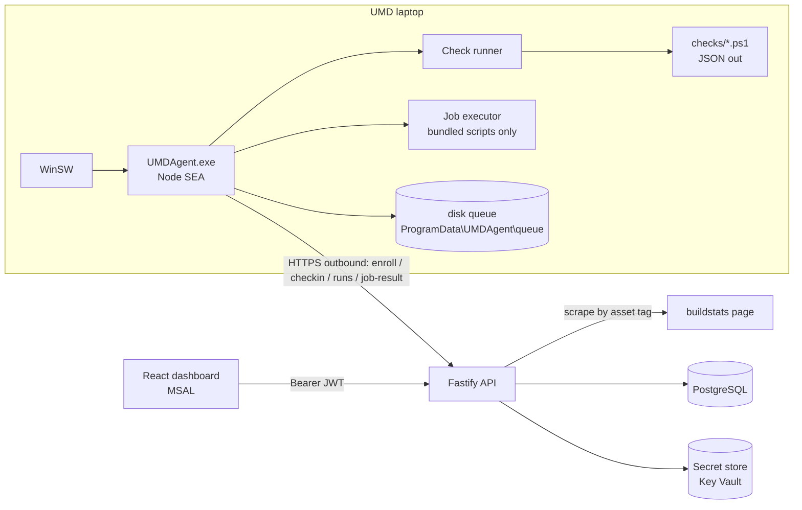

# UMD Post-Imaging Validation — Build Plan

> **Audience:** an implementation agent (or a developer) working one task at a time.
> **Source:** *UMD 1.6 Imaging & Validation* checklist (MAY2026) plus the design review.
> **Status:** design approved in principle. Values marked `TBD(P0-x)` come from the
> Phase 0 laptop walkthrough (§10). Do not invent them — leave the placeholder.

---

## 0. Rules for the implementing agent

1. Work **one task from §9 at a time**. Each task lists its inputs, outputs and "done when" criteria. Stop when they are met.
2. Never hard-code an expected value (hash, version, host, app name). Expected values live in `golden/manifest.json` (§5.5) and reach the agent through policy.
3. Anything tagged `TBD(P0-x)` stays a placeholder plus a `// TODO(P0-x)` comment.
4. The agent **never** runs code sent by the server. It only runs scripts bundled inside its own install (§7).
5. **Secrets** (passwords, keys) never appear in logs, results, evidence, the DB, git or this doc. Compare hashes, not values. The source checklist contains plaintext passwords. Never copy them into code or config.
6. Check scripts are **read-only**. The agent never partitions, formats or initializes a disk, and never edits BIOS settings.
7. Every task ships with unit tests. A task is not done while tests are red.
8. Stay inside the scope in §1. If something seems to need more, write it under "Open questions" in your task summary. Do not build it.

---

## 1. Goal and scope

**Goal:** Replace the paper checklist. After a UMD (Panasonic rugged laptop, QJ0681xxxx) finishes SCCM imaging, prove automatically that each validation step passed, show per-device progress on a dashboard, apply a small set of safe fixes, and track the steps that stay manual.

**Device lifecycle (stages):** the dashboard shows progress through these in order.

| Stage | What happens (source checklist) | Automated by agent |
|---|---|---|
| S1 `image` | Imaging finished, Mechanic login, Intel GCC, 24 apps, background | Mostly |
| S2 `config` | 787 MCDF / Toolbox, display, Firefox, LSAPL, UMD Tools, sign-out fix | Mostly |
| S3 `hardware` | SIM + 4 TB drive swap, cellular APN, myboeingfleet.com | Verification yes, physical work no |
| S4 `bios` | BIOS update, BIOS settings, Secure Boot | Partly (§6.1) |
| S5 `register` | RFID tag, Central server entry | No. Dashboard shows serial + asset tag to copy |

**In scope**
- Windows service agent, its installer, and its check scripts
- Fastify API with PostgreSQL
- React dashboard with Entra ID SSO
- Rule/policy engine, whitelisted remediation, audit log
- Manual-step attestation (a digital paper checklist)

**Out of scope**
- Replacing SCCM/Intune/Company Portal, or deploying patches (the agent only checks them)
- Any remote shell, or running arbitrary scripts from the UI
- Changing BIOS settings or disk layout
- Mobile app, multi-tenancy, high availability

---

## 2. Constraints that shape the design

| # | Constraint | Consequence |
|---|---|---|
| C1 | A Windows service runs in **Session 0**, where it cannot see or launch the user's desktop | GUI checks (launching MCDF/Toolbox, 3D render, screenshots, changing resolution) are `needs_human` in v1 |
| C2 | The service runs as **LocalSystem** | It can read every profile. It reaches the network as the computer account `DOMAIN\HOST$`, so NAS ACLs must grant the UMD computer group access (TBD(P0-5)) |
| C3 | No inbound ports on the UMD | The agent pulls everything. One `checkin` call every 15 s serves as heartbeat and job poll |
| C4 | A Node SEA single exe cannot easily bundle native addons | No native npm modules. Windows data is read by shelling out to **Windows PowerShell 5.1** scripts that print JSON |
| C5 | A SEA exe does not speak the Service Control Manager protocol | Wrap it with **WinSW** (bundled in the installer) |
| C6 | Per-user state lives in the **`Mechanic`** profile | Files: read `C:\Users\Mechanic\…`. Registry: use `HKU\<MechanicSID>` if Mechanic is logged on. Otherwise `reg load` `NTUSER.DAT` into `HKU\UMDAgent_Mech`, read it, then `reg unload` it |
| C7 | Toolbox Offline uses a **legacy Firefox** (NPAPI plugins: Adobe Acrobat 11, Java) | `policies.json` is not supported. PDF and plugin settings come from `prefs.js`, and fixes are written to `user.js` |
| C8 | Some checks depend on physical state (docked, SIM in, 4 TB in) | Checkin reports `onAC`, `lanUp`, `wwanReady`. A check whose precondition is unmet returns `skip` with `skipReason: "precondition"`. That counts as pending, not failed |
| C9 | SCCM deploys the agent as part of the image | Enrollment uses a **group bootstrap token** baked into the SCCM package (multi-use, expiring, revocable). The server issues each device its own key |
| C10 | Hardware swaps happen with the power off | The full run at service start (+2 min) picks up SIM and disk changes. No hardware polling is needed |

---

## 3. Architecture



**Stack**
- **Agent:** Node 22 SEA, TypeScript, PowerShell 5.1 check scripts, WinSW, Inno Setup (wrapped for SCCM)
- **API:** Node 22, Fastify, zod, Drizzle ORM + drizzle-kit, pino, jose (JWKS)
- **Web:** React, Vite, Tailwind, shadcn/ui, TanStack Query, MSAL React
- **Shared:** `packages/contracts` holds the zod schemas used by agent, API and web

---

## 4. Repo layout

```
umd-validation/
  apps/
    agent/            # Node service (TS)
      src/
      checks/         # one .ps1 per check type (§6.2)
      scripts/        # whitelisted job + remediation scripts (§7)
      installer/      # Inno Setup .iss, WinSW xml
    api/              # Fastify
      src/
      drizzle/        # migrations
    web/              # React
    mock-agent/       # CLI that fakes an agent (dev + tests)
  packages/
    contracts/        # zod schemas + TS types
  golden/
    manifest.json     # expected values captured in Phase 0
    fixtures/         # saved buildstats HTML, sample command outputs
  docker-compose.yml  # postgres for dev
  pnpm-workspace.yaml
```

---

## 5. Contracts

### 5.1 Rule

```jsonc
{
  "id": "lsapl.truststore",            // stable slug, see §6.1
  "name": "LSAPL trust store present and correct",
  "stage": "config",                   // image | config | hardware | bios
  "type": "fileHash",                  // check type, see §6.2
  "params": {
    "path":   "C:\\Boeing\\LSAPL-SMT\\Keys\\ee-prod-smt-trust.jks",
    "source": "C:\\com-code-client\\ee-prod-smt-trust.jks",
    "sha256": "@golden:lsapl.truststore.sha256"   // resolved server-side
  },
  "severity": "critical",              // critical | warn
  "timeoutMs": 10000,
  "remediation": { "scriptId": "lsapl-restore-file", "params": { "file": "truststore" }, "auto": false },
  "hint": "LSAPL error 'missing JKS file'. Run fix, then retry LSAPL."   // shown to tech on fail
}
```

### 5.2 Result

```jsonc
{
  "ruleId": "lsapl.truststore",
  "status": "fail",                    // pass | fail | error | skip | needs_human
  "skipReason": null,                  // not_applicable | precondition   (only when status = skip)
  "expected": "sha256:ab12…",
  "actual": "sha256:ff90…",
  "evidence": { "path": "...", "size": 4312 },   // ≤ 8 KB, redacted, no secrets
  "durationMs": 212,
  "checkedAt": "2026-09-26T14:03:11Z"
}
```

- `error`: the check itself broke (timeout, script exception). The device state is unknown.
- `needs_human`: it cannot be automated on this device. It shows up as a manual item until someone attests it (§5.6).
- `skip / not_applicable`: counts as pass (for example, the touchscreen check on a non-touch model).
- `skip / precondition`: counts as pending (for example, the myboeingfleet check before a SIM is inserted).

### 5.3 Readiness (computed by the server)

A **stage is complete** when every rule in it is `pass` or `skip/not_applicable`, or is attested (§5.6), and every manual item in it is attested.

| State | Rule |
|---|---|
| `not-ready` | any `critical` rule is `fail` or `error` |
| `in-progress` | no critical failures, but some stage is incomplete |
| `degraded` | all stages complete, but a `warn` rule is `fail`/`error` |
| `ready` | all stages complete, nothing failing |
| `stale` | display override when the last checkin is more than 10 min old |

### 5.4 API

**Agent** (header `X-Device-Key`; the key is stored hashed with SHA-256 on the server and DPAPI-protected at machine scope on the agent)

| Method | Path | Purpose |
|---|---|---|
| POST | `/api/agent/v1/enroll` | `{bootstrapToken, hostname, serial, assetTag, model}` → `{deviceId, deviceKey}`. If the serial is already enrolled (re-image), the device is re-keyed and keeps its history |
| POST | `/api/agent/v1/checkin` | Every 15 s. Sends `{agentVersion, osBuild, uptime, onAC, lanUp, wwanReady}` and receives `{policyVersion, jobs[], runNow}` |
| GET | `/api/agent/v1/policy` | Fetches the resolved rule list, only when `policyVersion` has changed |
| POST | `/api/agent/v1/runs` | `{runId, trigger, startedAt, finishedAt, results[]}`. Idempotent on `runId` |
| POST | `/api/agent/v1/jobs/:id/result` | `{status, exitCode, stdout≤64KB, stderr≤64KB}` |

**User** (`Authorization: Bearer <Entra JWT>`, verified against JWKS; roles `Viewer`, `Tech`, `Admin`)

| Method | Path | Role |
|---|---|---|
| GET | `/api/v1/devices` · `/devices/:id` · `/devices/:id/runs` · `/runs/:id` | Viewer |
| GET | `/api/v1/devices/:id/checklist` (stages, rules, manual items, attestations) | Viewer |
| POST | `/api/v1/devices/:id/attestations` `{itemId \| ruleId, note}` | Tech |
| POST | `/api/v1/devices/:id/run` `{stage?}` (run checks now) | Tech |
| POST | `/api/v1/devices/:id/jobs` `{scriptId, params}` | Tech |
| GET | `/api/v1/jobs/:id` | Viewer |
| GET/PUT | `/api/v1/policies` · `/policies/:id` | Admin |
| GET | `/api/v1/scripts` (read-only catalog) | Viewer |
| GET | `/api/v1/audit` | Admin |
| POST | `/api/v1/enrollment-tokens` `{label, maxUses, expiresAt}` | Admin |

**Job lifecycle:** `queued → dispatched → running → succeeded | failed | timed_out`. A job still `dispatched` after 5 min becomes `timed_out`.

**Tables:** `devices` (includes `serial`, `asset_tag`, `model`, `variant`, `last_seen_at`, `readiness`, `stage_progress`), `enrollment_tokens`, `device_keys`, `policies`, `rules`, `policy_rules`, `device_policy`, `runs`, `results`, `manual_items`, `attestations`, `scripts`, `jobs`, `audit_log`.
Heartbeats only update `devices.last_seen_at`.

### 5.5 Golden manifest (`golden/manifest.json`)

This file is captured from the reference UMD in Phase 0. Rules point into it with `@golden:<key>`. **It holds hashes only, never secrets.**

```jsonc
{
  "capturedFrom": "TBD(P0-4)", "capturedAt": "…",
  "assetTagPattern": "^QJ0681\\d{4}$",
  "apps.required":  [ { "name": "…", "minVersion": "…" } ],        // TBD(P0-4)
  "desktop.icons":  [ { "name": "787 MCDF", "scope": "public" } ],  // 24 entries, TBD(P0-4)
  "os.build": "TBD", "os.minUbr": 0,
  "gpo.required": [ "TBD" ],
  "bios.version": { "touch": "TBD(P0-11)", "nontouch": "TBD(P0-11)" },
  "bios.bootFirst": "TBD(P0-15)",
  "wallpaper.sha256": "TBD(P0-9)",
  "toolbox.minStamp": "20260629074759",       // from Offline_AAL_HTML5-FULL_<stamp>_F_*
  "toolbox.parts": 6,
  "ff.profileDir": "TBD(P0-7)",
  "lsapl.connections.sha256": "TBD(P0-9)",
  "lsapl.truststore.sha256":  "TBD(P0-9)",
  "lsapl.appprops.keyHashes": { "deviceLoginPassword": "sha256:…", "trustStorePassword": "sha256:…" },
  "lsapl.logErrorPatterns": [ "TBD(P0-14)" ],
  "airwall.serviceName": "TBD(P0-14)",
  "umdtools.allowedWarnings": [ "Configure OS", "Install Firefox", "Install SCX-ASCM", "Install VPN", "Set Alternate IP" ],
  "cell.apn": { "profileName": "AA FirstNet", "apn": "32871.fn" },
  "disk.data": { "minBytes": 3800000000000, "maxBytes": 4100000000000 },
  "net.groundHost": "TBD(P0-2)",
  "nas.wallpaperDir": "…\\Desktop background 03FEB25\\"
}
```

### 5.6 Manual items (the digital paper checklist)

These are seeded into `manual_items`. A Tech ticks them in the dashboard, and the tick is recorded as an attestation with user, time and note. Any `needs_human` rule can be attested the same way.

| Stage | Item |
|---|---|
| S1 | Device is BES'd · OOBE temp setup done · QJ label applied (the asset-tag value itself is checked automatically) · BIOS pre-image settings entered · re-image started |
| S2 | 787 MCDF opens · 3D DMC diagram renders (Ch. 21 Air Conditioning) · Toolbox Remote (ML) opens · LSAPL "Connected to Ground Network" · Airwall request submitted for QJ |
| S3 | SIM inserted and cap screwed back · old drive removed and 4 TB installed |
| S4 | BIOS update run (for the right variant) · supervisor password set |
| S5 | RFID tag applied and scanned · device added to Central (EID = asset tag, serial from dashboard, Gallery Type 1) |

---

## 6. Checks

### 6.1 Catalog (v1)

`sev`: C = critical, W = warn. "Fix" is a remediation script (§7). "Hint" is text shown to the tech.

#### S1 `image`

| ID | Pass when | How | Sev | On fail |
|---|---|---|---|---|
| `img.buildstats` | The newest build row for this asset tag has a Finished time and a green status | **Server** fetches `http://desktopconfig.corpaa.aa.com/buildstats/` by asset tag and parses the newest row (layout TBD(P0-4)) | C | Red → hint "re-image". Still running and < 7 h → `skip/precondition` |
| `hw.identity` | Asset tag matches `assetTagPattern`. Serial, model and SKU are reported | `Win32_SystemEnclosure.SMBIOSAssetTag`, `Win32_BIOS.SerialNumber`, `Win32_ComputerSystem` | C | Hint: run *Panasonic PC Asset Tag Entry* |
| `acct.mechanic` | Local user `Mechanic` exists and is enabled. `PasswordLastSet` goes in evidence; the password is never tested | `Get-LocalUser` | C | Hint: reset the password per checklist |
| `os.build` | OS build equals `os.build` | `CurrentBuild` registry value | C | — |
| `os.patch` | UBR is at least `os.minUbr` | `UBR` registry value | C | — |
| `gpo.applied` | Every GPO in `gpo.required` is applied | `gpresult /scope computer /x` | W | — |
| `app.intel-gcc` | Intel Graphics Command Center installed | `Get-AppxPackage -AllUsers *IntelGraphicsExperience*` | C | Hint: Company Portal install → ask the "Managed By" owner → re-image. MCDF needs this app |
| `app.required-set` | Every app in `apps.required` is present at or above its min version | HKLM Uninstall keys (64- and 32-bit) | C | — |
| `ui.desktop-icons` | The 24 `desktop.icons` exist on the Public or Mechanic desktop, and each `.lnk` target exists | Parse `.lnk` files with `WScript.Shell` | C | Hint: SCCM delivery problem |
| `ui.wallpaper` | Image in `C:\Users\Mechanic\AppData\Roaming\Microsoft\Windows\Themes\CachedFiles` hashes to `wallpaper.sha256` | `Get-FileHash` | W | Hint: reboot twice first. Fix `wallpaper-restore` (copies from NAS, takes effect at next sign-in) |

#### S2 `config`

| ID | Pass when | How | Sev | On fail |
|---|---|---|---|---|
| `tbx.files-current` | `C:\787\ToolboxRemote787` has `deploy\` plus `Offline_AAL_HTML5-FULL_<stamp>_F_index`, `_F_Part_1_of_6` … `_F_Part_6_of_6` and `_F_Setup`. All share one `<stamp>`, the stamp is at least `toolbox.minStamp`, no file is 0 bytes, and none is `.tmp`/partial | Name and size only. **Do not hash** (~12 GB) | C | Hint: SCCM not delivering; escalate to the SCCM owner |
| `tbx.shortcuts` | `787 MCDF` and `Toolbox Remote (ML)` shortcuts exist and their targets exist | `.lnk` parse | C | — |
| `tbx.launch` | Toolbox Remote (ML) launches | needs user session | W | v1: `needs_human` |
| `ui.display` | 1920×1080 and scaling Stretched | `Win32_VideoController` for resolution; scaling registry key TBD(P0-6) | W | Hint: Intel GCC → Display → Scale → Stretched, then Display settings → 1920×1080 |
| `ff.acrobat-plugin` | The Toolbox Firefox profile has `pdfjs.disabled=true` and `plugin.state.nppdf32=2` (Always Activate), and Acrobat's `nppdf32.dll` exists | Parse `prefs.js` + `user.js` in `ff.profileDir`. Exact prefs confirmed in TBD(P0-7) | C | Fix `ff-acrobat-prefs` (writes `user.js`; refuses to run while firefox.exe is running) |
| `ff.startup-popups` | Firefox is not enabled in the Mechanic `StartupApproved\Run` key, and there is no Firefox `.lnk` on the Public Desktop | Registry (C6) + file | W | Fix `ff-disable-startup` |
| `lsapl.connections` | `C:\Boeing\LSAPL-SMT\App\conf\connections.properties` has the same hash as `C:\com-code-client\connections.properties`, which matches golden | `Get-FileHash` | C | Hint: "LSAPL is not a location". Fix `lsapl-restore-file` (local copy with backup) |
| `lsapl.truststore` | `C:\Boeing\LSAPL-SMT\Keys\ee-prod-smt-trust.jks` has the same hash as the `C:\com-code-client` copy, which matches golden | `Get-FileHash` | C | Hint: "missing JKS file". Fix `lsapl-restore-file` |
| `lsapl.app-props` | In `C:\Boeing\LSAPL-SMT\App\conf\application.properties`, the SHA-256 of `deviceLoginPassword` and `trustStorePassword` match golden | `propsKeyHash` (never outputs the values) | C | Hint: "check tools>log for details". Fix `lsapl-patch-props` (§7) |
| `lsapl.airwall-icon` | No `AirwallAgent*.lnk` on the Public or Mechanic desktop | File absent | W | Fix `delete-shortcut` |
| `lsapl.airwall-agent` | Airwall Agent service is installed and running | `Get-Service` (name TBD(P0-14)) | W | Hint: request that the QJ be added to Airwall |
| `lsapl.backend` | Every host:port in `connections.properties` accepts TCP | Parse the file, then `Test-NetConnection`. Precondition: `lanUp` | C | Hint: Airwall enrollment missing? Ground network down? |
| `lsapl.log` | Newest LSAPL log has no line matching `lsapl.logErrorPatterns` | Tail the log (path TBD(P0-14)) | W | Evidence = matching lines (redacted) |
| `umd.conformance` | Every conformance task is green, except those in `umdtools.allowedWarnings` | CLI exit code or report file (TBD(P0-3)). Else `needs_human` | C | Hint: open UMD Tools → Check Conformance |
| `sccm.pkg-12650` | Sign-out fix package installed | `root\ccm\ClientSDK` (class TBD(P0-8)) | W | Fix `sccm-rerun-12650` (the tech is warned it signs out the user) |
| `net.ground` | Ground-network host reachable | TCP/HTTPS probe. Precondition: `lanUp` | C | — |

#### S3 `hardware`

| ID | Pass when | How | Sev | On fail |
|---|---|---|---|---|
| `cell.sim-ready` | Ready State = `Initialized` | `netsh mbn show readyinfo interface=*` | C | `SIM not inserted` → hint: reseat the SIM, screw the cap back |
| `cell.data-slot` | SIM 1 is the data SIM | `netsh mbn show slotmapping` (TBD(P0-13)) | W | Hint: Cellular settings → "Use this SIM for cellular data" |
| `cell.apn` | A profile named `AA FirstNet` with APN `32871.fn` exists | `netsh mbn show profiles` (storage TBD(P0-13)) | C | Hint: Mobile operator settings → Add APN |
| `cell.myboeingfleet` | HTTPS to `myboeingfleet.com` returns 2xx/3xx **over the WWAN interface** | `curl.exe --interface <wwan-ip> -sS -o NUL -w "%{http_code}"`. Precondition: `wwanReady` | C | Replaces the manual "undock and open Edge" step |
| `disk.data.*` | See §6.3 | | | |
| `disk.os-health` | OS disk Healthy with at least 20 GB free | `Get-PhysicalDisk`, `Get-Volume C` | W | — |

#### S4 `bios`

| ID | Pass when | How | Sev | On fail |
|---|---|---|---|---|
| `bios.version` | BIOS version equals `bios.version[variant]`. Variant (touch or non-touch) comes from model/SKU, TBD(P0-11) | `Win32_BIOS.SMBIOSBIOSVersion` | C | Hint: run the BIOS package for this variant from the NAS. **The touch-only package fails on non-touch units** |
| `bios.secureboot` | Secure Boot on | `Confirm-SecureBootUEFI` | C | Hint: Security → Secure Boot Control → Enabled |
| `bios.bluetooth-off` | No Bluetooth radio enumerated (BIOS-disabled devices disappear from the OS) | `Get-PnpDevice -Class Bluetooth -PresentOnly` | W | Hint: Advanced → Wireless → Bluetooth Disabled |
| `bios.touch-off` | No HID touch screen present. Non-touch variant → `skip/not_applicable` | `Get-PnpDevice -PresentOnly` filtered by touch | W | Hint: Advanced → Touchscreen Disabled |
| `bios.boot-order` | First firmware boot entry matches `bios.bootFirst`, and no UEFI PXE/LAN entries exist | `bcdedit /enum firmware` (TBD(P0-15)) | W | Hint: Boot → UEFI Boot from LAN Disabled; set Boot Option #1 |
| `bios.settings` | Power On AC = Enabled, Concealed Mode = Disabled, Password on Boot = Disabled, supervisor password set | Panasonic WMI if it exists (TBD(P0-1)), else `needs_human` | W | — |

### 6.2 Check type contract

Each type is one script, `apps/agent/checks/<type>.ps1`:

- **Input:** `-ParamsJson '<json>'`
- **Output:** exactly one JSON line on stdout: `{"status":…,"skipReason":…,"expected":…,"actual":…,"evidence":{…}}`
- **Exit code:** 0 when the check ran, whatever its verdict. Non-zero or invalid JSON → the runner records `error`.
- Run as `powershell.exe -NoProfile -NonInteractive -ExecutionPolicy Bypass -File <script> -ParamsJson …`
- **Read-only.** When a precondition is unmet or hardware/WMI is missing, return `skip` or `needs_human`, never `error`.

Types: `fileHash`, `fileAbsent`, `fileSetPattern` (toolbox), `shortcutSet`, `registryValue`, `userHiveValue`, `appSet`, `appxPresent`, `localUser`, `osVersion`, `gpoApplied`, `identity`, `biosVersion`, `biosSetting`, `secureBoot`, `pnpAbsent`, `firmwareBootOrder`, `dataDisk`, `diskHealth`, `networkReachable`, `httpCheck`, `wwanHttp`, `mbnReady`, `mbnSlot`, `apnConfig`, `firefoxPrefs`, `displayConfig`, `propsKeyHash`, `propsHostsReachable`, `logScan`, `serviceRunning`, `sccmProgram`, `command`.

### 6.3 4 TB data drive (`disk.data.*`)

**Purpose:** prove the 4 TB drive is physically present, correctly seated, healthy, and left unconfigured, and that the old drive is gone. This is the first hardware question after the swap.

**Selecting the drive:** from `Get-Disk`, take disks that are not `IsBoot`, not `IsSystem`, have `BusType ≠ USB`, and whose `Size` is within `disk.data.minBytes … maxBytes` (a "4 TB" drive is about 4.0e12 bytes, or 3.64 TiB).

| ID | Pass when | How | Sev | On fail |
|---|---|---|---|---|
| `disk.data.present` | Exactly **one** disk matches | `Get-Disk` | C | 0 found → hint "not detected: power off, reseat the caddy, confirm it is the 4 TB unit". More than 1 → evidence lists them |
| `disk.data.seated` | Its `Win32_DiskDrive` has `Status = OK` and `ConfigManagerErrorCode = 0`, and the System log has no disk/storahci/stornvme errors in the last 24 h (IDs 7, 11, 51, 129, 153) | CIM + `Get-WinEvent` | W | Hint: loose or damaged seating. Reseat it |
| `disk.data.health` | `HealthStatus = Healthy`, `PredictFailure = false`, and uncorrected read/write errors = 0 where reported | `Get-PhysicalDisk`, `root\wmi MSStorageDriver_FailurePredictStatus`, `Get-StorageReliabilityCounter` | C | Hint: replace the drive |
| `disk.data.unconfigured` | `PartitionStyle = RAW`, 0 partitions, no volume or drive letter | `Get-Disk`, `Get-Partition` | C | Hint: the drive must stay unconfigured. **No auto-fix. The agent never wipes a disk** |
| `disk.old-removed` | No other internal non-boot disk is present | `Get-Disk` | W | Hint: the old drive may still be installed |

Evidence for every row: model, serial, firmware, bus type, size in bytes, health, partition style, and online/offline state (the expected offline/online state is TBD(P0-12)).
Precondition: none. These checks run in every full run, including the one at service start after the swap (C10). A tech can also press **"Re-check hardware"**, which sends `POST /devices/:id/run {stage:"hardware"}`.

### 6.4 Runner behavior
- Triggers: service start (+2 min), hourly, `runNow` from checkin, and per-stage runs from the dashboard.
- Runs at most 4 checks at a time and enforces each rule's `timeoutMs`, killing the process tree on timeout.
- Writes the whole run to the disk queue as one file, then uploads it. Deletes the file only after a 2xx.
- Queue cap: 500 files, oldest dropped first. Retry backoff: 15 s, doubling up to 10 min.

---

## 7. Jobs and remediation

- **Script catalog is bundled in the agent** (`apps/agent/scripts/*.ps1` + `catalog.json`). The server only mirrors the IDs for display. A job carries `scriptId` + `params` and nothing else.
- The agent rejects any `scriptId` that is not in its local catalog, and any params that fail that script's zod schema. The rejection is posted as a `failed` job result.
- Limits: 5 min timeout, 64 KB stdout/stderr (truncated), one job at a time.
- **Remediation flow:** check fails → rule has `remediation` and (`auto: true` **or** a Tech triggered it) → back up the target to `ProgramData\UMDAgent\backup\<ts>\` → run the script → re-run that check → post both results and an audit entry.
- Anti-flap: at most one auto-fix per rule per run. After 2 consecutive failed fixes, auto is disabled for that device and rule until a Tech resets it.
- `auto` defaults to `false` for every rule in v1. Turn it on per policy after the pilot.

| scriptId | Does | Notes |
|---|---|---|
| `lsapl-restore-file` | Copies `connections.properties` or `ee-prod-smt-trust.jks` from `C:\com-code-client` to its LSAPL destination | Local copy only. Aborts if the source hash ≠ golden |
| `lsapl-patch-props` | Sets `deviceLoginPassword` / `trustStorePassword` in `application.properties` | Values are fetched from the secret store at job time, passed on stdin, and never logged or stored in `jobs`. TBD(P0-16) whether an approved secret store exists; until then v1 is hint-only |
| `wallpaper-restore` | Copies the golden image from `nas.wallpaperDir` into Mechanic's `CachedFiles` | Needs NAS ACL (C2) |
| `ff-acrobat-prefs` | Appends `pdfjs.disabled` / `plugin.state.nppdf32` to `user.js` | Refuses to run while Firefox is running |
| `ff-disable-startup` | Marks Firefox disabled in Mechanic `StartupApproved\Run` and deletes the Public Desktop Firefox `.lnk` | — |
| `delete-shortcut` | Deletes the Airwall `.lnk` from the Public and Mechanic desktops | Allowed only for names in the allowlist |
| `sccm-rerun-12650` | Re-runs SCCM package 12650 | Signs the user out. The UI confirms first |
| `run-checks-now` | Starts a full or single-stage run | — |

**Not in v1 (operator-only, v2):** `bios-update`. Preconditions: on AC and docked, correct variant package, `Suspend-BitLocker -RebootCount 1`. It restarts the device. It will **never** be `auto`.

---

## 8. Security

- TLS for every call. The agent pins the internal CA bundle shipped in the installer.
- Device keys are 32 random bytes, stored hashed server-side, and can be revoked per device. Bootstrap tokens are revocable and have `maxUses` and `expiresAt`.
- In dev, `AUTH_MODE=dev` skips Entra. The API **refuses to start** with `AUTH_MODE=dev` when `NODE_ENV=production`.
- Rate limits: 60/min per device key and 300/min per user.
- Audit log (append-only; the app DB user has no UPDATE or DELETE on it) records enrollments, job creation and results, policy edits, remediations, attestations, and auth failures.
- Evidence is filtered through a redactor that drops keys and `key=value` lines matching `/pass|secret|token|key|pwd/i`.
- The installer ACLs `ProgramData\UMDAgent` to SYSTEM and Administrators only.
- **Source checklist hygiene:** the MAY2026 checklist PDF has plaintext credentials. Keep it out of this repo, and raise credential rotation with the owners.

---

## 9. Task backlog (for the agent)

Tasks run in order unless the dependencies say otherwise. Each task is one PR.

| ID | Task | Depends | Done when |
|---|---|---|---|
| T1 | Scaffold the monorepo (§4): pnpm workspaces, TS config, eslint, vitest, docker-compose Postgres | — | `pnpm -r build` and `pnpm -r test` pass |
| T2 | `packages/contracts`: zod for Rule, Result, Run, Checkin, Job, JobResult, Policy, ManualItem, Attestation | T1 | Unit tests show valid samples from §5 parse and bad ones are rejected |
| T3 | API: Drizzle schema and migrations for the §5.4 tables; seed `manual_items` from §5.6 | T1 | `pnpm db:migrate && pnpm db:seed` runs cleanly on a fresh Postgres |
| T4 | API: agent endpoints, device-key auth, bootstrap tokens (maxUses/expiry), re-enroll by serial, stage and readiness calc (§5.3) | T2, T3 | Tests: bad or missing key → 401, expired or used-up token → 401, run is idempotent on `runId`, a table test covers every readiness state |
| T5 | `mock-agent` CLI: enroll, check in, post runs covering every status, finish jobs | T4 | Starting 5 mock devices fills the DB and shows all readiness states |
| T6 | API: user endpoints, Entra JWT via JWKS, roles, attestations, `AUTH_MODE=dev` guard | T4 | Tests: no token → 401, Viewer attesting → 403, prod + dev mode → process exits |
| T7 | Web: fleet list (readiness + stage progress), device checklist view (per-stage rules with expected vs actual, hint, fix button, manual ticks), run history, jobs panel, identity card (serial + asset tag for Central) | T6 | Works against mock-agent data, and the build passes |
| T8 | Agent core: config, enroll, DPAPI key storage, 15 s checkin with `onAC/lanUp/wwanReady`, disk queue, pino file logs with rotation | T2 | Unit tests (mocked HTTP and fs) show the queue survives a restart and backoff works |
| T9 | Agent runner (§6.4) plus PS invocation wrapper and Mechanic hive load/unload helper (C6) | T8 | Tests with stub `.ps1` files cover timeout → `error`, bad JSON → `error`, the concurrency cap, and that the hive is always unloaded |
| T10 | Check scripts **S1**: `identity`, `localUser`, `osVersion`, `gpoApplied`, `appxPresent`, `appSet`, `shortcutSet`, `fileHash` | T9 | Pester tests pass on a Windows VM or CI runner |
| T11 | Check scripts **S2**: `fileSetPattern`, `displayConfig`, `firefoxPrefs`, `userHiveValue`, `fileAbsent`, `propsKeyHash`, `propsHostsReachable`, `logScan`, `serviceRunning`, `sccmProgram`, `command`, `networkReachable` | T9 | Pester tests pass, and a test proves `propsKeyHash` output never contains the raw value |
| T12 | Check scripts **S3**: `dataDisk`, `diskHealth`, `mbnReady`, `mbnSlot`, `apnConfig`, `wwanHttp` | T9 | Pester tests with mocked `Get-Disk` outputs cover none / one / two / partitioned / unhealthy disks, and SIM absent vs ready |
| T13 | Check scripts **S4**: `biosVersion` (variant aware), `secureBoot`, `pnpAbsent`, `firmwareBootOrder`, `biosSetting` | T9 | Pester tests pass, and missing WMI → `needs_human` |
| T14 | Packaging: SEA build, WinSW xml, Inno Setup with install, upgrade and uninstall, ProgramData ACLs, SCCM detection rule, bootstrap token param | T8 | On a clean Windows VM without Node, a silent install enrolls and the device appears in the dashboard |
| T15 | Jobs and remediation (§7): catalog, executor, backup, re-check, anti-flap, v1 scripts | T9, T4 | Tests: unknown `scriptId` rejected, bad params rejected, fix → re-check → audit row written |
| T16 | Server buildstats scraper (`img.buildstats`) | T4, P0-4 | Parser tests against saved fixtures cover green-finished, red, and in-progress |
| T17 | Pilot on 1–2 real UMDs. Compare agent output with the paper checklist and log every mismatch | all | Mismatch log reviewed, and every mismatch is fixed or accepted |

---

## 10. Phase 0: laptop walkthrough (human, before T10–T13)

**Technique:** for any setting whose storage location is unknown, snapshot before and after doing the manual step, then diff. Snapshot = `reg export` of HKLM\SOFTWARE, the Mechanic hive and `HKLM\SYSTEM\CurrentControlSet\Control\GraphicsDrivers`, plus a file listing with hashes of the relevant folders. Save the outputs to `golden/fixtures/`.

| Key | Question | How |
|---|---|---|
| P0-1 | Does the Panasonic BIOS expose WMI classes (Power On AC, Concealed Mode, passwords)? | `Get-CimClass -Namespace root\wmi \| ? CimClassName -match 'Pana'` |
| P0-2 | Ground-network probe host and port | Ask the network team, or reuse the LSAPL backend host |
| P0-3 | Does UMD Tools have a CLI, exit code, or report file ("View Report")? | Check the install folder, `--help`, and where View Report writes |
| P0-4 | App list with versions, the 24 desktop icons, and buildstats HTML for green, red and in-progress rows | Export HKLM Uninstall keys; list both desktops; save the pages |
| P0-5 | NAS read access for the computer account (wallpaper, BIOS packages) | `PsExec -s cmd` → `dir \\esstop203p-green-smb-isilon…\…` |
| P0-6 | Registry location of Intel GCC "Stretched" scaling | Before/after diff |
| P0-7 | Which Firefox Toolbox Offline launches: exe path, version, profile dir, and which prefs change for "Use Adobe Acrobat" and "Always Activate" | Before/after diff of `prefs.js`, `handlers.json` and `mimeTypes.rdf` |
| P0-8 | SCCM WMI class and ID for package 12650 | `Get-CimInstance -Namespace root\ccm\ClientSDK -ClassName CCM_Program` |
| P0-9 | SHA-256 of the LSAPL files (both locations), wallpaper, `application.properties` key values (hash only) | `Get-FileHash`; hash the values locally |
| P0-10 | Entra tenant ID, client IDs, app-role names | Identity team |
| P0-11 | Model/SKU that identifies touch vs non-touch; expected BIOS version for each variant | `Win32_ComputerSystem` (Model, SystemSKUNumber), `Win32_BIOS` after each package |
| P0-12 | 4 TB drive: model, bus type, exact `Size`, online/offline state after insert; what the "old drive" is | `Get-Disk \| fl *` before and after the swap |
| P0-13 | WWAN: `readyinfo` output with and without a SIM, `slotmapping` output, where the "App APN" is stored | `netsh mbn show …` before and after the step |
| P0-14 | Airwall Agent service name; LSAPL log path and exact error strings | `Get-Service *airwall*`; reproduce the errors |
| P0-15 | `bcdedit /enum firmware` output; what "UEFI Kingston" boot option #1 refers to | Run as admin after BIOS setup |
| P0-16 | Is there an approved secret store (Key Vault) for LSAPL values? | Security / platform team |

---

## 11. Verification (end to end)

1. Unit tests per check type, plus a whitelist-denial test and a no-secret-in-output test.
2. `docker compose up` → migrate → 5 mock agents → dashboard shows every readiness state and stage progress.
3. Auth: valid JWT → 200, no token → 401, wrong role → 403, bad device key → 401.
4. Job round trip (UI → checkin → execute → result) finishes in 30 s or less.
5. SEA exe on a clean VM without Node: silent install, and a heartbeat appears within 1 min.
6. 4 TB: on a real UMD, the agent reports correctly with no drive, then with the drive seated. A partitioned test drive → `disk.data.unconfigured` fails.
7. Real UMD: agent verdicts match the paper checklist for every in-scope item.
