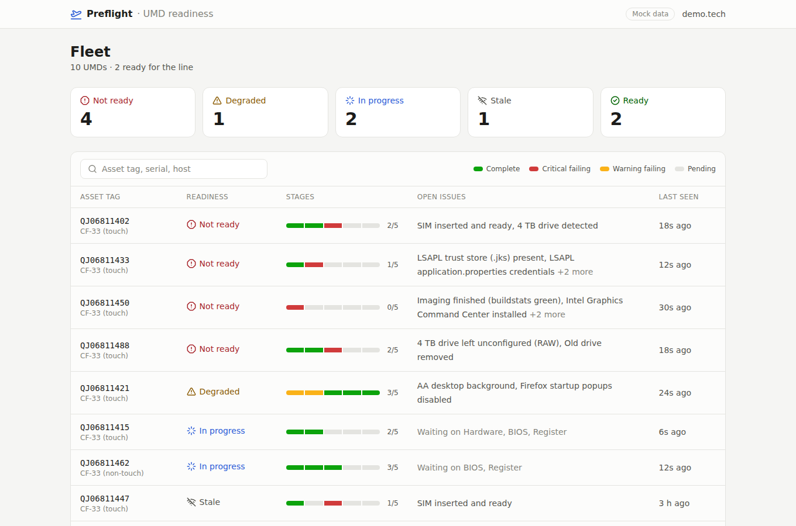
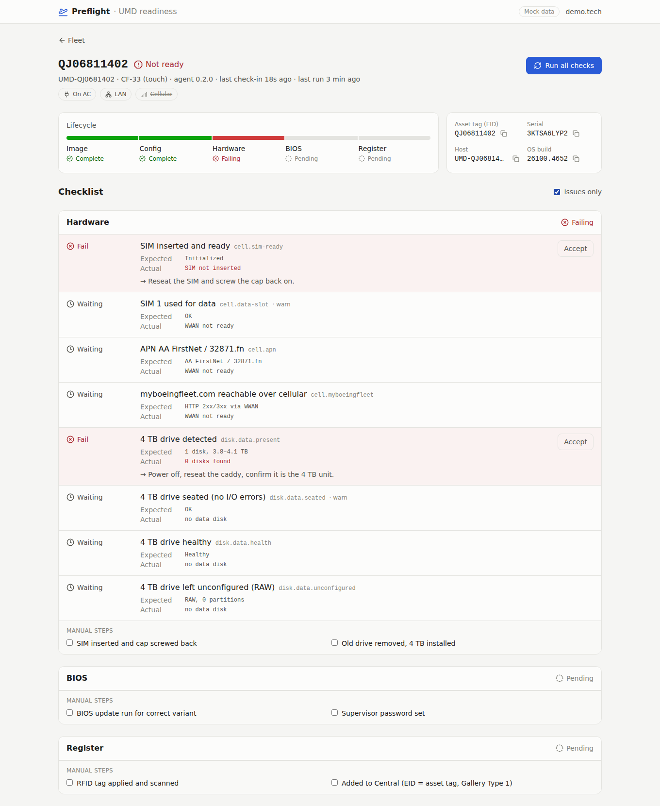
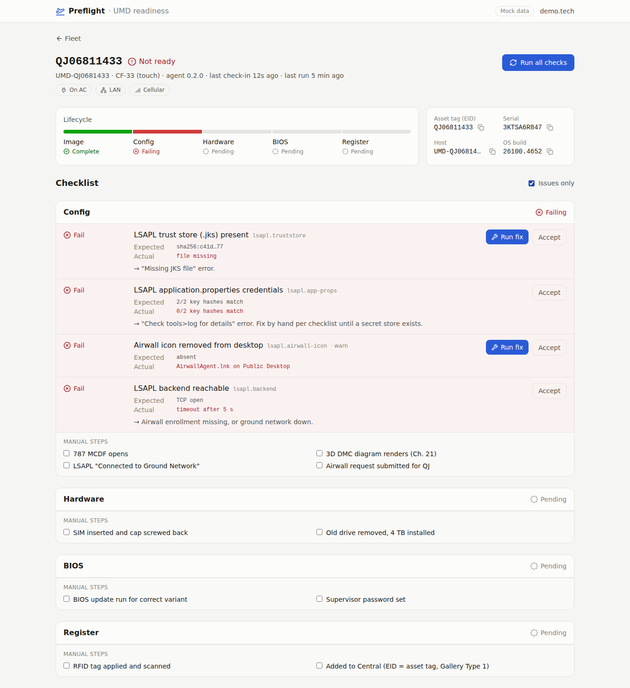

# Preflight — UMD readiness

Post-imaging validation for UMD rugged laptops (Panasonic, QJ0681xxxx). Replaces the paper checklist after SCCM imaging:
an agent on each laptop runs the checks, a dashboard shows every laptop's readiness, and techs trigger whitelisted fixes and tick the manual steps.

- Design: [PLAN.md](./PLAN.md)
- Laptop day (one-liners): [PHASE0.md](./PHASE0.md)
- Hosting the server: [HOSTING.md](./HOSTING.md)

| Fleet | Device (4 TB missing) | Device (LSAPL fixes) |
|---|---|---|
|  |  |  |

## Try it (any PC with Node 22 — no Docker, no database install)

```bash
corepack enable && pnpm install
pnpm build
pnpm demo          # http://localhost:3000 — API + dashboard + 5 fake laptops
```

## Pieces

| Piece | What it is |
|---|---|
| `apps/agent` | `PreflightAgent.exe` (Node single executable). `check` runs everything locally, `service` is the background loop. Checks are `checks/*.ps1` (Windows PowerShell 5.1, read-only); fixes are `scripts/*.ps1` (whitelisted, back up first). `installer/` builds the exe + zip and installs the Windows service (WinSW). |
| `apps/api` | Fastify API + serves the dashboard. Postgres in production, embedded PGlite otherwise. Migrations run on start. |
| `apps/web` | React dashboard: fleet, per-device checklist, fixes, manual steps. `?mock` shows demo data. |
| `apps/mock-agent` | Fake laptops for demos and tests. |
| `packages/contracts` | Shared schemas, the check catalog, readiness logic. |
| `golden/manifest.json` | Expected values from the reference laptop (hashes only, never secrets). |

## Commands

```bash
pnpm test          # all unit + integration tests (PowerShell script tests need `pwsh`)
pnpm lint
pnpm build
pnpm start         # API + dashboard on :3000 (env: see HOSTING.md)
pnpm dev:api       # API with reload on :3000
pnpm dev:web       # dashboard with hot reload on :5173 (proxies /api to :3000)
pnpm agent:check   # run the agent's checks on this machine (Windows)
```

Windows build of the agent: `powershell -File apps/agent/installer/build-exe.ps1` → `apps/agent/out/preflight-agent-win-x64.zip`.
CI builds the same zip on every push (artifact **preflight-agent-win-x64**) and runs every check on a real Windows runner.

## Rules of the road (PLAN.md §0)

- Never hard-code an expected value; it lives in `golden/manifest.json`. Unset values (`TBD…`) make checks report what they found as *needs human*.
- Check scripts are **read-only**. The agent never partitions/formats disks or edits BIOS.
- The agent only runs scripts bundled in its own install; the server can pick a script ID + validated params, nothing else.
- No secrets in code, logs, results, evidence, DB or git. Compare hashes, not values.
